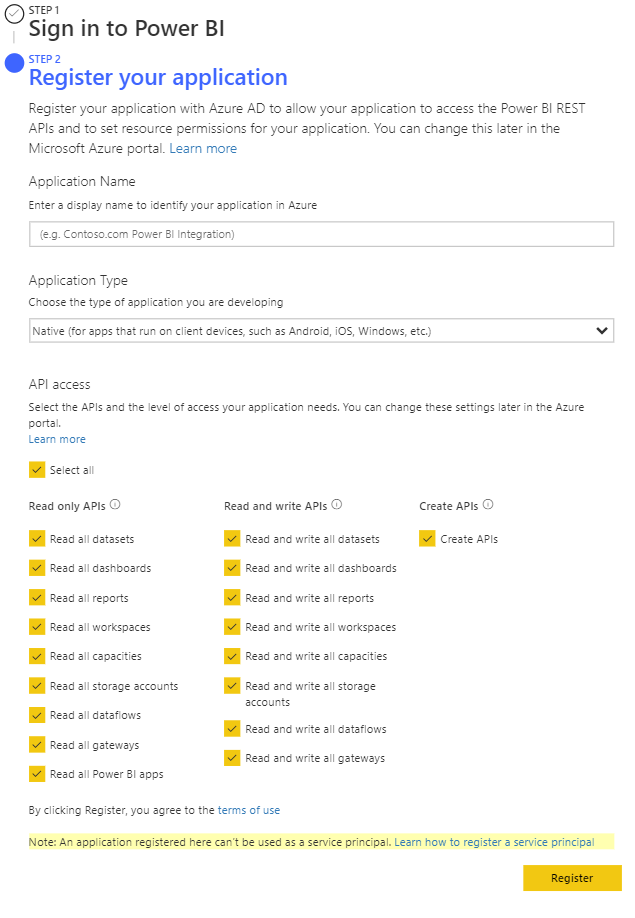
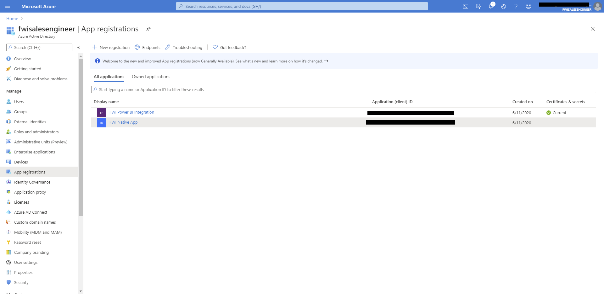
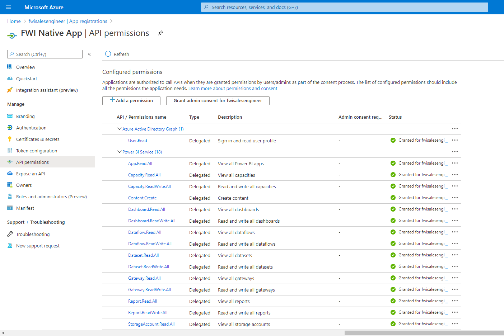

# FWI Microsoft PowerBI Integration

## Getting Started

You'll need to have (or work with someone who has) admin privileges to AzureAD/Microsoft 365.  If you're just testing, you can setup your own trial admin account through the [Microsoft developer program](https://developer.microsoft.com/en-us/microsoft-365/dev-program).

### Registering your App

In order to start utilizing PowerBI's REST API's you'll first need to [Register you application](https://dev.powerbi.com/Apps) with Azure AD.  For this tutorial we'll be registering a Native app, so all you'll need for now is the app name and designated permissions.  Within the [PowerBI REST API Documentation](https://docs.microsoft.com/en-us/rest/api/power-bi/) you can find the required permissions for each API--or you can just select all permissions to make it easier.

If your App registers successfully, you should recieve an `App Id`, copy this down in a safe place as you'll need it later.  If you're having issues registering the app--you'll likely need to contact your Azure Admin.

#### App Permissions

With your App registered, you'll need to make sure your user account(s) have permissions to make requests through your app.  Navigate to and login to your [Azure Portal](https://portal.azure.com/) then navigate into Azure Active Directory.  In the left navigation bar of Azure, select `App registrations`.

Within App registrations, select your app, view API permissions, and make sure your designated user account(s) have granted access for each of your API permissions.  Again, you can also easily grant admin consent for your whole domain.

## Building the Integration

If you haven't already, make sure you download and install [Postman](https://www.postman.com/downloads/)

### Acquiring your Access & Refresh Tokens

In order to make requests to the Power BI APIS, you'll need the required OAuth Access token (and refresh token if you're making periodic requests).  Open up Postman and create a new `POST` request for this URL: [https://login.microsoftonline.com/common/oauth2/token](https://login.microsoftonline.com/common/oauth2/token).  In the body of your `POST` request set the type to `form-data` and enter the following fields:

| Key           | Value         |
|:-------------:|:-----------------------------------------:|
| client_id | `<yourclientid>` |
| grant_type | password |
|resource | https://analysis.windows.net/powerbi/api |
