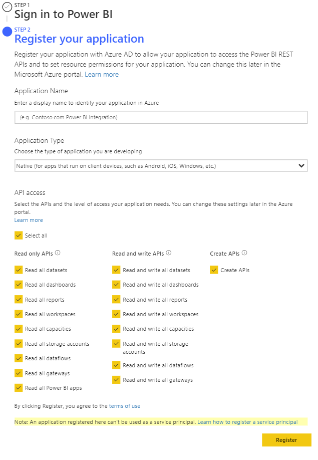
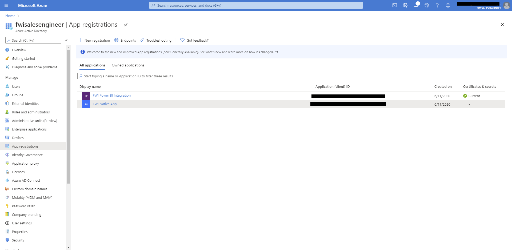
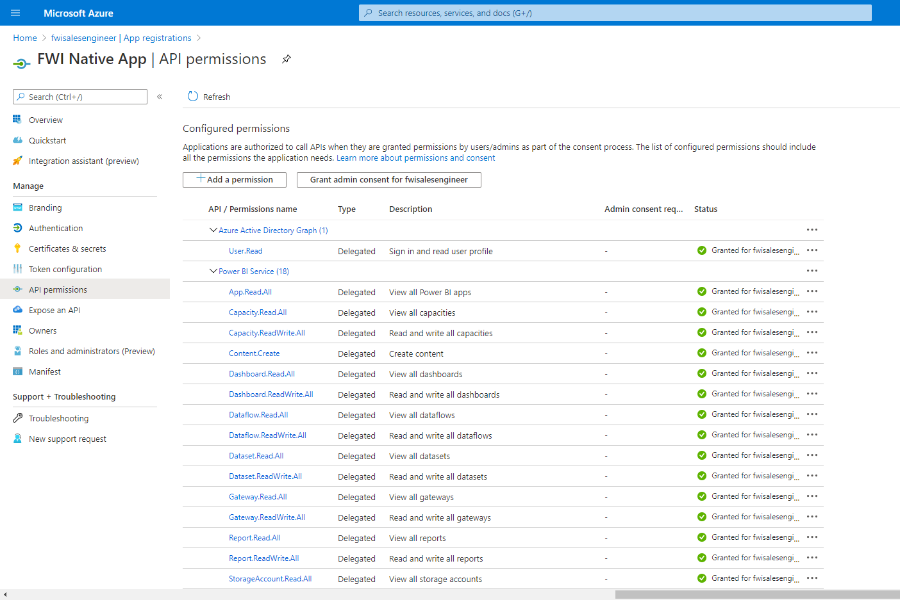
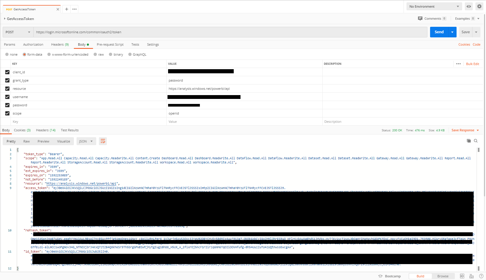
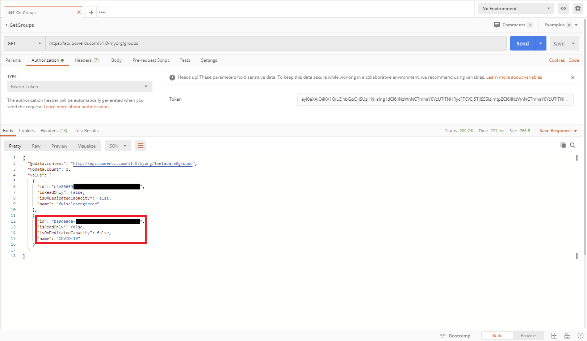
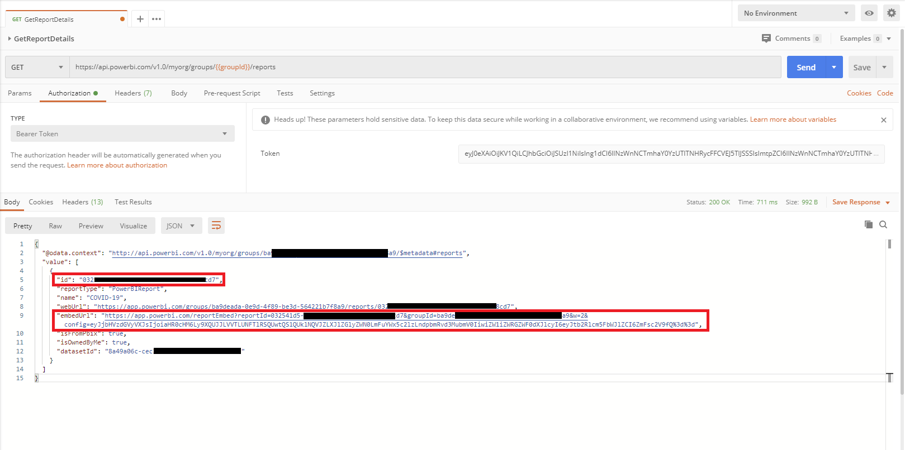
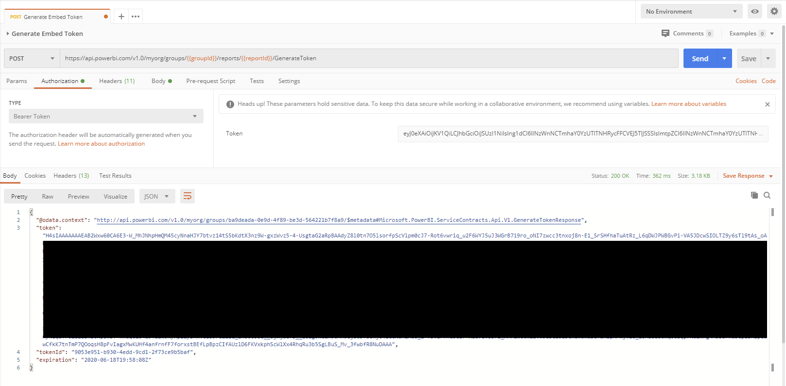

# FWI Microsoft PowerBI Integration

### Disclaimer

This tutorial is intended for employees of Four Winds Interactive.  If you're unaffiliated with FWI and looking to develop with Power BI's REST APIs this tutorial is unlikely to be helpful.

## Getting Started

You'll need to have (or work with someone who has) admin privileges to AzureAD/Microsoft 365.  If you're just testing, you can setup your own trial admin account through the [Microsoft developer program](https://developer.microsoft.com/en-us/microsoft-365/dev-program).

### Registering your App

In order to start utilizing PowerBI's REST API's you'll first need to [Register you application](https://dev.powerbi.com/Apps) with Azure AD.  For this tutorial we'll be registering a Native app, so all you'll need for now is the app name and designated permissions.  Within the [PowerBI REST API Documentation](https://docs.microsoft.com/en-us/rest/api/power-bi/) you can find the required permissions for each API--or you can just select all permissions to make it easier.



If your App registers successfully, you should recieve an `App Id`, copy this down in a safe place as you'll need it later.  If you're having issues registering the app--you'll likely need to contact your Azure Admin.

### App Permissions

With your App registered, you'll need to make sure your user account(s) have permissions to make requests through your app.  Navigate to and login to your [Azure Portal](https://portal.azure.com/) then navigate into Azure Active Directory.  In the left navigation bar of Azure, select `App registrations`.



Within App registrations, select your app, view API permissions, and make sure your designated user account(s) have granted access for each of your API permissions.  Again, you can also easily grant admin consent for your whole domain.



## Building the Integration

If you haven't already, make sure you download and install [Postman](https://www.postman.com/downloads/)

To get a head start, you can import my [Postman Collection](https://www.getpostman.com/collections/8491549621eab53f65aa) and utilize the necessary calls with minimal configuration.

### Acquiring your Access & Refresh Tokens

In order to make requests to the Power BI APIS, you'll need the required OAuth Access token (and refresh token if you're making periodic requests).  Open up Postman and create a new `POST` request for this URL: `https://login.microsoftonline.com/common/oauth2/token`.  In the body of your `POST` request set the type to `form-data` and enter the following fields:

*Note: FWI Employees should be able to obtain test credentials [here](https://fourwindsinteractivehq-my.sharepoint.com/:t:/g/personal/will_karges_fourwindsinteractive_com/EX5AWcQRn8lKhXrRjUjGXYkBxrIL7W5TOG2F3Ub8WwxxwQ?e=MbW3kr).*

| Key           | Value         |
|:-------------:|:-----------------------------------------|
| client_id | `<yourclientid>` |
| grant_type | password |
| resource | https://analysis.windows.net/powerbi/api |
| username | `<yourusername>` |
| password | `<yourpassword>` |
| scope | openid |

With the fields correctly entered you should recieve your `Access Token` and `Refresh Token` in the response.  You'll need to copy these down and save them for later.



The most common error you recieve in the response is due to insufficient account permissions.  I've only been able to get this call to work with maximum permissions attached to the account making the call.  If you're having issues you may need to do some research in the [Power BI authorization and/or API documentation](https://docs.microsoft.com/en-us/power-bi/).

### Acquiring your Embed Token

With your Access Token acquired you should be able to apply it as a Bearer Token and utilize any and all of the PowerBI REST APIs.  For this tutorial we'll need to obtain an embed token so we can securely embed our PowerBI report into a Content Manager HTML content item.

In order to do so we'll need to aquire the `groupId` and `reportId` parameters to append them to the Generate Embed Token URL.

#### Getting necessary Parameters

First you'll need to obtain your `groupId` through the Get Groups API.  In Postman create a new `GET` request with this URL, `https://api.powerbi.com/v1.0/myorg/groups`.  In the Authorization tab set the type to `Bearer Token` and copy/paste the `Access Token` from the previous section.  

Submit the request and your `groupId(s)` should appear in the response.  Make sure your selected group contains the report you're wanting to display.



Create a new `GET` request with the Get Report Details URL, `https://api.powerbi.com/v1.0/myorg/groups/{{groupId}}/reports`.  If you're using the [Postman Collection](https://www.getpostman.com/collections/8491549621eab53f65aa) you can update the `groupId` variable or simply replace the parameter in the URL.

In addition to updating the `groupId` don't forget to add your Bearer Token Authorization.  Submit the request to obtain your `reportId` and `embedUrl`, both of which will be needed later.



#### Generate Embed Token

Create a new `POST` request with the Generate Embed Token URL `https://api.powerbi.com/v1.0/myorg/groups/{{groupId}}/reports/{{reportId}}/GenerateToken`, update the parameters `groupId` and `reportId` parameters, and update the `Bearer Token` Authorization.  Finally, copy the following JSON script to the body of the request:

```json
{
  "accessLevel": "View",
  "allowSaveAs": "false"
}
```

With all of that configured you can submit the request to obtain your Embed Token.




